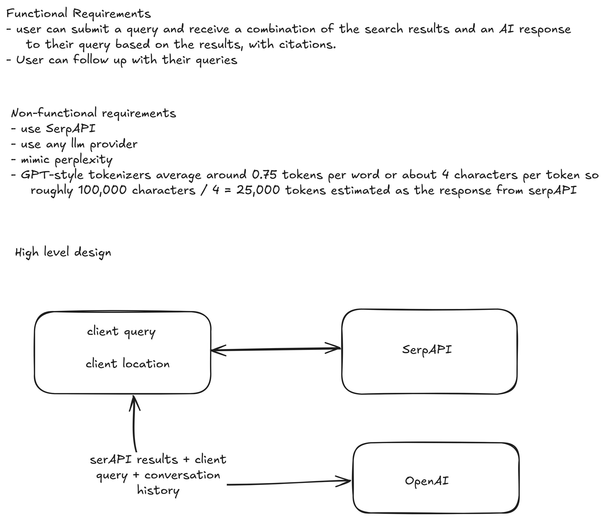

# Perplexity Clone

A Perplexity-style AI search app that answers questions with sources. Built with Next.js, TypeScript, and OpenAI.

## Try it out

1. Clone the repo
2. `cd web`
3. `npm install`
4. Add your OpenAI API key and serp API key to `.env`
5. `npm run dev`
6. Open http://localhost:3000
